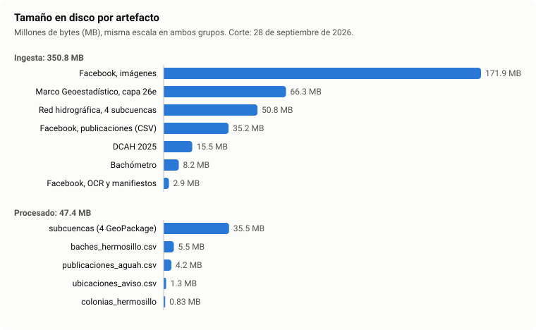
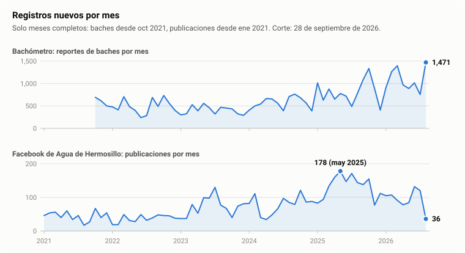

# Las cinco V de los datos del proyecto

Corte: 28 de septiembre de 2026, corrida de `make data` de las 21:00 (hora de Hermosillo),
commit `1cfa2ad`.

## Fuentes de ingesta

- Bachómetro Hermosillo (`data/raw/bachometro/`): reportes de baches de la API
  `https://bachometro.hermosillo.gob.mx/mapa/ajax`. 6 JSON, uno por año de 2021 a 2026;
  8.2 MB; 39,018 reportes.
- INEGI, Delimitación de colonias y otros asentamientos humanos (DCAH) 2025
  (`data/raw/inegi/dcah/`): ZIP de Sonora bajado por rango del paquete nacional, con el
  shapefile `26as`, el catálogo de asentamientos y los metadatos; 15.5 MB; 2,699
  asentamientos.
- INEGI, Marco Geoestadístico 2025, capa `26e` (`data/raw/inegi/mg/`): ejes de vialidad de
  Sonora; shapefile y metadato bajados por rango del paquete estatal; 66.3 MB; 229,303
  tramos de calle.
- INEGI, Red hidrográfica 1:50 000, edición 2.0 (`data/raw/inegi/subc_*/`): subcuencas La
  Poza, R. Sonora - Hermosillo, La Manga y R. San Miguel; un ZIP por subcuenca con 5 capas
  (`hl`, `dr`, `ha`, `subc`, `to`); 50.8 MB; 48,023 geometrías.
- Facebook de Agua de Hermosillo (`data/external/`, sin `FUENTE.txt`, documentado en
  `data/SNAPSHOT.md`): 7 CSV del scraper Apify con 5,200 publicaciones del 07/12/2020 al
  14/09/2026 (35.2 MB), 3,203 imágenes (171.9 MB) y su texto extraído con PaddleOCR-VL 1.6
  (7 CSV). Snapshot congelado.

## Datos tidy procesados, primera iteración

- `data/processed/bachometro/baches_hermosillo.csv`: una fila por reporte de bache;
  39,018 × 10; 5.5 MB. Fuente: Bachómetro. Diccionario: `references/baches.csv`.
- `data/processed/aguah/publicaciones_aguah.csv`: una fila por publicación, con texto,
  OCR, reacciones y variables derivadas; 5,200 × 32; 4.2 MB. Fuente: Facebook.
  Diccionario: `references/publicaciones_aguah.csv`.
- `data/processed/aguah/colonias_hermosillo.csv` y `.gpkg`: una fila por asentamiento del
  municipio de Hermosillo; 783 × 10, más el polígono en el GeoPackage; 0.83 MB. Fuente:
  DCAH. Diccionario: `references/colonias_hermosillo.csv`.
- `data/processed/aguah/ubicaciones_aviso.csv`: una fila por lugar mencionado en una
  publicación; 16,261 × 8; 1.3 MB. Fuentes: publicaciones, colonias y calles del Marco
  Geoestadístico. Diccionario: `references/ubicaciones_aviso.csv`.
- `data/processed/inegi/subc_*/subc_*.gpkg`: un GeoPackage por subcuenca con 5 capas;
  47,426 geometrías; 35.5 MB. Fuente: Red hidrográfica. Diccionarios:
  `references/subc_*.csv`.

## Volumen

| Etapa | Artefacto | Tamaño | Archivos | Registros | Columnas |
|---|---|---:|---:|---|---|
| Ingesta | Bachómetro | 8.2 MB | 6 | 39,018 reportes | 7 |
| Ingesta | DCAH 2025 | 15.5 MB | 1 | 2,699 asentamientos | 10 |
| Ingesta | Marco Geoestadístico, capa `26e` | 66.3 MB | 6 | 229,303 tramos | 11 |
| Ingesta | Red hidrográfica, 4 subcuencas | 50.8 MB | 4 | 48,023 geometrías | 3 a 22 por capa |
| Ingesta | Facebook, publicaciones | 35.2 MB | 7 | 5,200 publicaciones | 936 a 2,000 por archivo; 2,709 distintas, 1,984 siempre vacías |
| Ingesta | Facebook, imágenes | 171.9 MB | 3,203 | 3,203 imágenes | no aplica |
| Ingesta | Facebook, OCR y manifiestos | 2.9 MB | 21 | 5,200 filas de OCR | 4 |
| Intermedio | `data/interim/`, ZIP del INEGI extraídos | 107.9 MB | 117 | | |
| Procesado | `baches_hermosillo.csv` | 5.5 MB | 1 | 39,018 | 10 |
| Procesado | `publicaciones_aguah.csv` | 4.2 MB | 1 | 5,200 | 32 |
| Procesado | `colonias_hermosillo` (CSV y GeoPackage) | 0.83 MB | 2 | 783 | 10, más el polígono |
| Procesado | `ubicaciones_aviso.csv` | 1.3 MB | 1 | 16,261 | 8 |
| Procesado | `subc_*.gpkg` | 35.5 MB | 4 | 47,426 geometrías | 2 a 6 por capa |
| Total | Ingesta | 350.8 MB | 3,248 | | |
| Total | Procesado | 47.4 MB | 9 | | |

## Velocidad

| Etapa | Artefacto | Periodo | Ritmo de la fuente | Cómo se actualiza | Última actualización |
|---|---|---|---|---|---|
| Ingesta | Bachómetro | 17/09/2021 a 28/09/2026 | continuo: 16.1 reportes al día en 2022, 36.1 en 2026 | `make download` vuelve a bajar el año en curso y omite los anteriores | 29/09/2026 04:01 UTC |
| Ingesta | DCAH 2025 | edición 2025 | anual | descarga única; se omite si ya existe | datos a 11/2025 (21 asentamientos a 11/2022); descarga del 25/09/2026 |
| Ingesta | Marco Geoestadístico | edición 2025 | anual | descarga única | descarga del 25/09/2026 |
| Ingesta | Red hidrográfica | edición 2.0 | sin actualización | descarga única | segmentos fechados de 1998 a 2010; descarga del 26/09/2026 |
| Ingesta | Facebook | 07/12/2020 a 14/09/2026 | continuo: mediana de 15 publicaciones por semana | extracción única: scraper de paga, imágenes con URL que expira, OCR en GPU (5.9 s por imagen) | snapshot v1, 17/09/2026 |
| Procesado | `baches_hermosillo.csv` | igual que su fuente | | `make data`, recalculado completo: 0.25 s | 28/09/2026 21:01 |
| Procesado | `publicaciones_aguah.csv` | igual que su fuente | | `make data`: 0.41 s | 28/09/2026 21:01 |
| Procesado | `colonias_hermosillo` | igual que su fuente | | `make data`: 0.63 s | 28/09/2026 21:01 |
| Procesado | `ubicaciones_aviso.csv` | igual que Facebook | | `make data`: 19.46 s | 28/09/2026 21:01 |
| Procesado | `subc_*.gpkg` | igual que su fuente | | `make data`: 0.68 s | 28/09/2026 21:01 |
| Procesado | `references/*.csv` | | | `make dictionary`, fuera de `make data` | baches: 25/09/2026; los demás: 26/09/2026 |

`make data` completo: 52 s, de los cuales 27.1 s son la descarga del año 2026 del
Bachómetro.

Datos del gráfico de velocidad

Reportes de baches por mes (`*` mes incompleto, fuera del gráfico).

| Año | ene | feb | mar | abr | may | jun | jul | ago | sep | oct | nov | dic |
|---|---:|---:|---:|---:|---:|---:|---:|---:|---:|---:|---:|---:|
| 2021 |  |  |  |  |  |  |  |  | 226* | 693 | 615 | 500 |
| 2022 | 479 | 413 | 706 | 484 | 400 | 240 | 283 | 688 | 489 | 732 | 553 | 398 |
| 2023 | 301 | 324 | 528 | 391 | 558 | 459 | 320 | 469 | 453 | 434 | 322 | 290 |
| 2024 | 406 | 501 | 543 | 665 | 656 | 560 | 391 | 710 | 764 | 680 | 565 | 389 |
| 2025 | 1,013 | 629 | 878 | 652 | 777 | 720 | 487 | 778 | 1,088 | 1,335 | 888 | 408 |
| 2026 | 909 | 1,265 | 1,397 | 970 | 889 | 1,015 | 755 | 1,471 | 1,116* |  |  |  |

Publicaciones de Agua de Hermosillo por mes (`*` mes incompleto, fuera del gráfico).

| Año | ene | feb | mar | abr | may | jun | jul | ago | sep | oct | nov | dic |
|---|---:|---:|---:|---:|---:|---:|---:|---:|---:|---:|---:|---:|
| 2020 |  |  |  |  |  |  |  |  |  |  |  | 45* |
| 2021 | 46 | 54 | 56 | 40 | 60 | 34 | 46 | 17 | 27 | 67 | 40 | 54 |
| 2022 | 19 | 19 | 49 | 31 | 28 | 49 | 32 | 39 | 48 | 46 | 45 | 38 |
| 2023 | 37 | 37 | 79 | 53 | 99 | 98 | 130 | 77 | 67 | 40 | 74 | 81 |
| 2024 | 82 | 111 | 40 | 34 | 48 | 66 | 97 | 85 | 79 | 121 | 86 | 88 |
| 2025 | 83 | 94 | 134 | 160 | 178 | 147 | 171 | 144 | 138 | 155 | 77 | 112 |
| 2026 | 105 | 107 | 91 | 78 | 84 | 132 | 120 | 36 | 16* |  |  |  |

## Variedad

| Etapa | Artefacto | Formato | Estructura | Geometría y CRS | Codificación | Tipos de columna |
|---|---|---|---|---|---|---|
| Ingesta | Bachómetro | JSON | lista de objetos; `neighborhoods` es una lista anidada | puntos como texto (lat, lon), sin CRS declarado | UTF-8 | 4 texto, 2 entero, 1 lista |
| Ingesta | DCAH 2025 | shapefile, CSV, TXT, XML y PDF | atributos y geometría; catálogo nacional aparte | polígonos, EPSG:6372 | UTF-8; metadatos en ISO-8859-1 | 10 texto |
| Ingesta | Marco Geoestadístico | shapefile y TXT | atributos y geometría | líneas, EPSG:6372 con un `.prj` sin código EPSG | ISO-8859-1 | 10 texto, 1 entero |
| Ingesta | Red hidrográfica | shapefile (5 capas), PDF y JPG | atributos y geometría | líneas, puntos y polígonos, EPSG:4019 | ISO-8859-1 | 72 atributos en 5 capas |
| Ingesta | Facebook | CSV, JPG, PNG, WEBP y CSV de OCR | JSON aplanado en columnas; texto libre; imágenes | sin geometría | UTF-8 | de las 725 columnas con datos: 422 texto, 145 numéricas, 158 booleanas |
| Procesado | `baches_hermosillo.csv` | CSV | tidy; `neighborhoods` como texto de lista (`"[551]"`) | lat y lon numéricos, WGS84 implícito | UTF-8 | 4 entero, 2 decimal, 1 fecha, 3 texto |
| Procesado | `publicaciones_aguah.csv` | CSV | tidy; 3 columnas de texto libre | sin geometría | UTF-8 | 18 entero, 6 texto, 4 booleano, 2 fecha, 2 decimal |
| Procesado | `colonias_hermosillo` | CSV y GeoPackage | tidy | centroides y polígonos, EPSG:4326 | UTF-8 | 7 texto, 3 decimal |
| Procesado | `ubicaciones_aviso.csv` | CSV | tidy; 3 catálogos cerrados | puntos, EPSG:4326, solo en cruces | UTF-8 | 1 entero, 5 texto, 2 decimal |
| Procesado | `subc_*.gpkg` | GeoPackage, 5 capas | atributos seleccionados | líneas, puntos y polígonos, EPSG:4019 | UTF-8 | 20 atributos por subcuenca: 10 texto, 9 entero, 1 decimal |

## Veracidad

| Etapa | Artefacto | Control | Hechos |
|---|---|---|---|
| Ingesta | Bachómetro | sha256 en `FUENTE.txt`: coincide | 266 reportes fuera de `HERMOSILLO_BOUNDS` (0 de 2021 a 2023, 31 en 2024, 64 en 2025 y 171 en 2026); 2,904 sin colonia, todos de 2026; 701 repiten coordenadas y fecha de otro; 9,637 IDs ausentes entre 1 y 48,655; `FUENTE.txt` sin descripción ni licencia |
| Ingesta | DCAH 2025 | sha256: coincide | 2 polígonos inválidos; 20 sin código postal (`00000`); 18 nombres compartidos por 38 asentamientos |
| Ingesta | Marco Geoestadístico | sha256: coincide | 9.0% de los tramos de la ciudad sin nombre (`NINGUNO`); 1,871 nombres usados por más de una calle |
| Ingesta | Red hidrográfica | sha256: coincide | escala 1:50 000; segmentos fechados de 1998 a 2010 |
| Ingesta | Facebook | `data/external.sha256`: 3,231 archivos | 14 días sin publicaciones en la frontera entre dos exports (5 al 19/04/2024); 19 imágenes no descargadas por URL expirada; 855 imágenes con OCR vacío; 5 de 7 `.meta.json` del OCR reconstruidos a mano |
| Procesado | `baches_hermosillo.csv` | sin reglas Pandera | conserva los 266 puntos fuera de rango y las 701 filas repetidas; `year` difiere del año de `date` en 1,584 filas; diccionario desfasado (describe 38,975 filas, hay 39,018) |
| Procesado | `publicaciones_aguah.csv` | Pandera: pasa | `event_type` = `otro` en 75.4%; `announced_start_at` nulo en 70.0%; `announced_duration_hours` nulo en 89.3%; `angry_share` nulo en 0.6%; `likes_count` igual a `reactions_total` en el 100% |
| Procesado | `colonias_hermosillo` | Pandera: pasa el CSV; el GeoPackage no se valida | 2 polígonos reparados; 20 `postal_code` = `00000` |
| Procesado | `ubicaciones_aviso.csv` | Pandera: pasa | 383 cruces sin resolver (20.7% de los cruces); `lat` y `lon` nulos en 91.0%, porque solo los cruces llevan punto; 12,031 de 14,411 menciones de colonia reconocidas por nombre suelto, sin el marcador "colonia" |
| Procesado | `subc_*.gpkg` | Pandera: pasan las 20 capas | 0% de nulos |

## Valor

| Etapa | Artefacto | Qué contiene | Se relaciona con |
|---|---|---|---|
| Ingesta | Bachómetro | ubicación, fecha, texto e ID de colonia del Bachómetro por reporte | nada por llave: sus IDs de colonia son propios |
| Ingesta | DCAH 2025 | catálogo oficial de asentamientos con polígono, tipo y código postal | clave `cvegeo` |
| Ingesta | Marco Geoestadístico | nombre, tipo y geometría de cada tramo de calle | insumo de `ubicaciones_aviso`: 41,538 tramos de la ciudad para geocodificar cruces |
| Ingesta | Red hidrográfica | cauces, puntos de drenaje, cuerpos de agua y topónimos | por ubicación |
| Ingesta | Facebook | texto, imagen, reacciones y comentario destacado de cada aviso | `postId` |
| Procesado | `baches_hermosillo.csv` | 39,018 reportes con coordenadas y fecha | sin llave a `colonias_hermosillo`; 35,025 (89.8%) caen dentro de uno de sus polígonos |
| Procesado | `publicaciones_aguah.csv` | tipo de evento (811 `emergencia`, 295 `corte_programado`, 134 `restablecimiento`, 41 `pipas`), 7 reacciones y `angry_share`, ventana de afectación anunciada, atributos de tiempo | `post_id` con `ubicaciones_aviso` |
| Procesado | `colonias_hermosillo` | 783 polígonos con nombre normalizado, tipo, código postal, área y centroide | `colonia_id` con `ubicaciones_aviso` |
| Procesado | `ubicaciones_aviso.csv` | 16,261 menciones en 3,788 publicaciones; 562 colonias distintas; 1,467 cruces con punto; `match_method` como nivel de confianza | une `publicaciones_aguah` con `colonias_hermosillo` |
| Procesado | `subc_*.gpkg` | 46,518 segmentos con orden de Strahler (`ORDER_1`), del 93% al 97% intermitentes; 744 cuerpos de agua; 124 topónimos del municipio | por ubicación |
